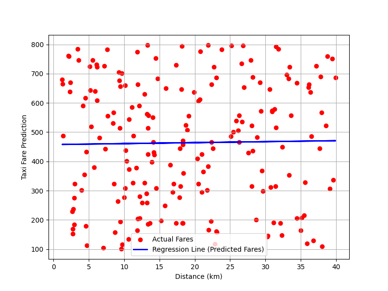

# 🚖 Taxi Fare Prediction from Distance

## 📋 Project Overview
This project predicts taxi fares based on trip distance using **linear regression**. The model identifies:  

- 💰 **Base Fare (Fixed cost)** – the minimum fare even for very short trips  
- 📏 **Fare per Kilometer** – additional fare charged per km  

The dataset includes trips with columns like `Distance_km`, `Fare_Rs`, `Duration_min`, `Traffic_Level`, `Driver_Rating`, and more. For this analysis, only `Distance_km` is used as input.

---

## 🗂 Dataset Details
- **Number of Records**: ~X (replace with your dataset size)  
- **Features Used**: `Distance_km` (input), `Fare_Rs` (target)  
- **Other Columns** (not used in this model): `Duration_min`, `Traffic_Level`, `Driver_Rating`, `Payment_Type`, `Day_of_Week`, `Time_of_Day`, `Weather`  
- **Purpose**: Predict fare for any given trip distance.

---

## 📊 Visualization
The relationship between distance and fare is visualized below:

- 🔴 **Red dots** → Actual fares from the dataset  
- 🔵 **Blue line** → Predicted fares from the regression model  

  
*Figure: Linear regression prediction of taxi fare based on distance*

> The plot shows a clear linear trend, validating the use of linear regression for predicting taxi fares.

---

## 🧠 Model Interpretation
- ⚡ **Intercept (Base Fare)**: Minimum fare charged regardless of distance.  
- ➕ **Coefficient (Fare per km)**: How much the fare increases per additional kilometer.  
- 🔍 Linear trend confirms the fare is mostly **proportional to distance**.  
- ⚠️ Outliers may indicate unusual trips or data entry errors.

---

## 💡 Insights
- 🚖 Fare structure is simple and linear: **fixed base fare + per km rate**.  
- 📊 Linear regression works well due to the clear linear relationship.  
- 🧮 Useful for fare estimation in ride-sharing apps or taxi services.  
- 📈 The model can identify unusual pricing patterns or errors in historical data.

---

## ✅ Conclusion
- Linear regression effectively models the taxi fare structure: **fixed base fare + variable per km**.  
- Visualization confirms the **strong linear relationship** between distance and fare.  
- Model interpretation and insights help in **data-driven fare estimation and anomaly detection**.
